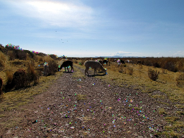
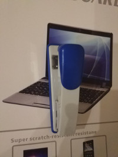
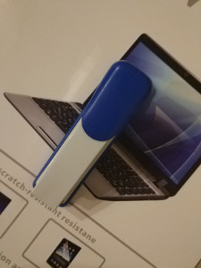
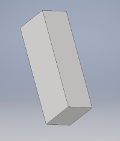
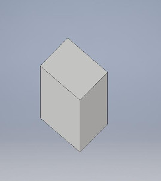
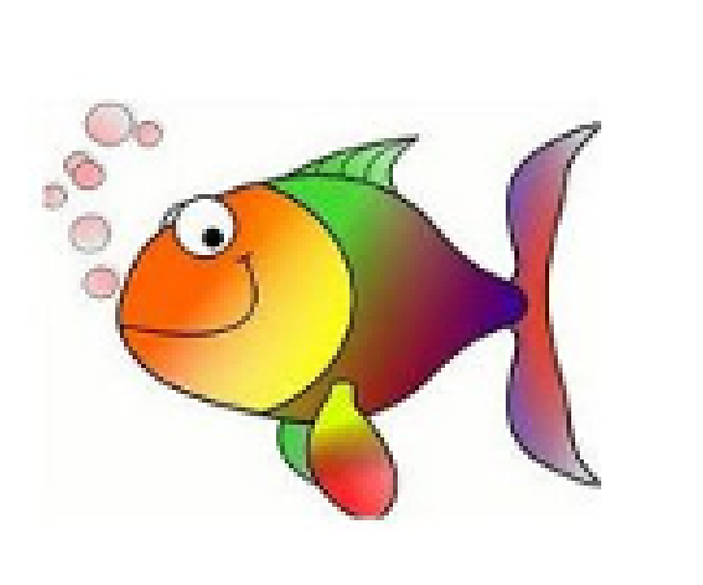

总结：首先知道想要什么，其次是能根据一部分轮廓和特征分析出全貌。


本工程是识别部分，这是我理解的图形识别的一小部分实现。目前图像识别主要运用的是特征点识别法，匹配这些关键点可以很容易的识别出一个物体。如下：   
 特征图:  
 
```
   A-KAZE Matching Results
 # Keypoints 1:                        	1707
 # Keypoints 2:                        	1707
 # Matches:                            	1707
 # Inliers:                            	1707
 # Inliers Ratio:                      	1
```
然而即使对于同一物体，不同位置或者不同设备采集到的图像也是不尽相同的，如果换个位置就可能无法识别了。   

正是由于这些缺陷，我想到了用3维特征识别，一个物体(不包括软体，如绳子)的3维特征永远是不变的(现在已经有由3D识别对象的了，但那是在理想状态下的)。先把背景设置为白色，通过一张图片生成立体对象，    

  
例如通过订书机的照片生成一个订书机的立体对象。这个立体对象不论我们从那个角度拍照，都有它的一个面可以对应我们照片上的一个面。先不考虑轮廓能不能完美识别，现在可以利用轮廓生成立体图形，把图片放到立体空间中，将轮廓向以图片视角看不到的方向拉伸。  
   
   原立体图像   
     
  观察角度  
     
 生成3d的图像   
      
   生成3d的图像  
可以看到它可以生成各种3d图像，这就需要像机械制图一样，知道对象的三视图了，只需要从不同角度拍照或者用录像也可以。此刻就好识别了，都生成立体对象，然后对比特征。  
    
这是来自opencv的图片，仔细看就会发现图片有很明显的锯齿，所以在计算机识别时要忽略这些锯齿，也就是先要模糊识别知道它是个鱼，然后精确识别知道它有锯齿。前边谈到生成立体对向是不断的拉伸，也可以根据综合条件去判断它是否是立体图形以及它的阴影（或者说是其它面），比如光线的变化、阴影的深度。如果能有多个角度学习一个立体对象，那是再好不过了。现实中更多的是一面之缘，这就需要举一反三了，可以根据物体的整个空间计算物体的大小，或者根据摄像头的焦距等计算物体的大小，如果再加个摄像头，就能够跟好的判断物体的立体图形了(多个镜头其实就是获取了物体和空间的多个观察方向了)。  
另外可以根据学习时获取的高度进行计算，比如一个实际的物体大3*3*3（m) ，但在图片看起来比较小，可以根据给出的参数还原它原来的大小，这样当我们在海洋里遇到鲸鱼是也不至于大吃一惊：这是什么玩意，这么大。  
我们能够计算物体的大小和画出物体的立体图像了，现在脱离较为理想的状态，开始考虑背景杂乱的情况，如订书机的那两张图片。可以看到这两张图片背景都是一个个人计算机和一些其它设备。我们从图片的边缘考虑，最外边图形是一些符号，反正不是什么具体内容，先当作不认识，里边是电脑和订书机。此时电脑和订书机互相干扰几乎无法确认他们的轮廓，这个时候就可以用前边识别英伟达的方式，先粗后精，忽略不必要的内容，利用神经网络识别出电脑，然后排除电脑，再去识别订书机。在现实中我们可以看到一颗树的一面而后在另一面也能认得这是一颗树，其实就是我们把外界干排除了并且同时计算了这颗树的外形。但是排除干扰有时候也会出现误差，比如有时我们找不到一个事实上就在那个位置的东西，其实也就是因为你的眼睛把它排除了，也可以怎么说：你所看到的只是你眼睛想看到的，不过这种情况其实也是可以通过训练解决的。  
举个例子，可以通过大小和相似可以判断他的基本类别。比如通过4个轮子判断是车，然后再判断是什么车。  

### 免责声明 
* 这是我一人之言，我不是专业人士，所有如有错误可以指点，但请不要指指点点，也不要做一个老神仙，说话说一半。 
* 本工程所有的图片版权和协议与此工程的协议无关，我自己画的图片可以随意使用(无版权)。 

